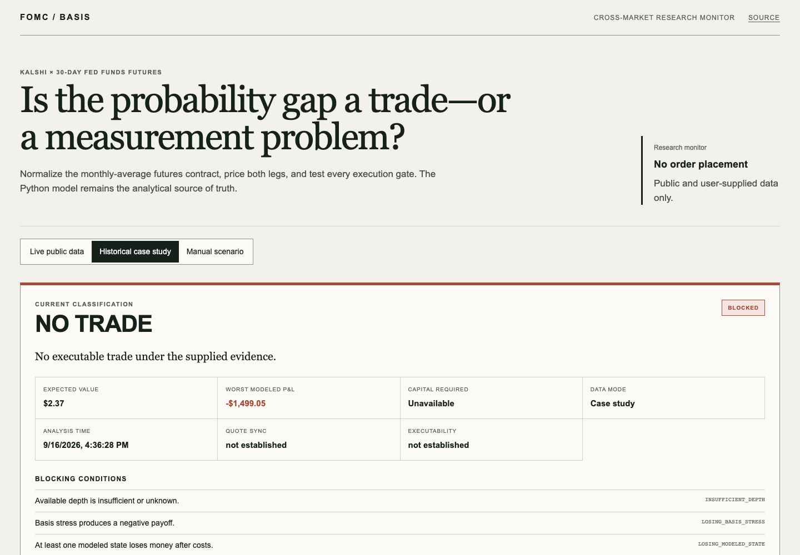

# FOMC Basis Monitor

An execution-aware research monitor that tests whether a probability gap between Kalshi FOMC contracts and 30-Day Fed Funds futures survives contract normalization, costs and hard trading constraints.

**[Open the live application](https://fed-funds-event-arbitrage.vercel.app)** · [Methodology](#methodology) · [Run locally](#local-development)



A positive expected value is not labeled arbitrage unless the supplied evidence establishes executable, fresh, synchronized and sufficiently deep quotes; compatible settlement; nonnegative payoff across every modeled and basis-stress state; and valid capital and position limits.

## Research question

Kalshi contracts settle on a specific target-rate outcome. A ZQ futures contract settles to the arithmetic average of daily effective federal funds rates across an entire calendar month. A displayed Kalshi probability and a number derived directly from `100 − ZQ price` therefore measure different things.

The model asks a narrower question. After removing the known pre-meeting portion of the monthly average and accounting for identification, execution, fees, basis risk and integer hedge sizing, is there a trade supported by the evidence?

## Architecture

```text
Browser
  │
  ├── Next.js App Router · TypeScript · Vercel Node.js runtime
  │       presentation, scenario inputs, charts, reason-code copy
  │
  └── /api/* · FastAPI · Vercel Python 3.13 runtime
          │
          ├── fomc_basis services and domain models
          ├── probability bounds, payoffs and classification
          └── public providers: Fed, New York Fed, Kalshi, Yahoo
```

The existing Python package is the only analytical implementation. The web client displays typed API results and does not reproduce the financial calculations in TypeScript. Streamlit remains available as a local research interface. SQLite is used only for local snapshots and replay; it is not treated as durable production storage on Vercel.

## Data modes

- **Live public data** — official FOMC dates, New York Fed EFFR and target context, public Kalshi definitions and books, and indicative Yahoo ZQ data. Live means recently retrieved public data, not synchronized or guaranteed-executable data.
- **Historical case study** — the supplied September 16, 2026 observation: `ZQU26.CBT` at 96.2600 / 96.2625, Kalshi exact +25 bp YES at $0.87 / $0.88, and EFFR at 3.63%. Source timestamps, depth, synchronization, executability and independent settlement verification remain explicitly unavailable.
- **Manual scenario** — controlled entry of dates, quotes, timestamps, depth, outcome, size, capital, costs, slippage, basis assumptions, settlement compatibility and tail constraints.

## Data sources

| Input | Source | Production treatment |
|---|---|---|
| FOMC meeting dates | Board of Governors of the Federal Reserve System | Official schedule; parser failures return a degraded response |
| EFFR and target context | Federal Reserve Bank of New York | Reference rate and target-range context |
| Event definitions and order books | Kalshi public Trade API | Unauthenticated public endpoints; asks are derived only from opposite-side bids |
| ZQ indication | Yahoo Finance via `yfinance` | Potentially delayed and not exchange-direct; last/previous close is never promoted to bid/ask |
| Historical fixture | User-supplied observation | Non-synchronized and non-executable unless evidence says otherwise |

Kalshi uses the current recommended production base URL, `https://external-api.kalshi.com/trade-api/v2`.

## Methodology

For a meeting whose rate decision becomes effective during the contract month:

```text
100 − F = (d_pre × r_pre + d_post × r_post) / D
```

The model solves for the futures-implied post-meeting EFFR, then expresses the expected move on a policy-state grid. Under a strict two-state 0/+25 bp assumption, that expectation maps to a +25 bp probability. Once cuts, larger hikes or other tails are admitted, futures identify an expected value rather than a unique exact-outcome distribution. The package therefore reports identified probability bounds separately from a regularized, prior-conditioned distribution used for point EV display.

State payoffs incorporate Kalshi fees, futures costs, margin, integer hedge sizing and EFFR/target basis stress. Classification remains deliberately conservative:

| Classification | Meaning |
|---|---|
| `TRUE_ARBITRAGE` | Every execution and evidence gate passes; every modeled and basis-stress state is nonnegative, with at least one positive state |
| `NEAR_ARBITRAGE_WITH_SMALL_BASIS_RISK` | Modeled state payoffs survive, with limited residual basis risk |
| `RELATIVE_VALUE_TRADE` | Expected value clears the hurdle, but at least one modeled state loses money |
| `NO_TRADE` | At least one evidence, execution, limit or payoff gate fails |

## API

The FastAPI boundary exposes:

```text
GET  /api/health
GET  /api/meetings?year=YYYY
GET  /api/case-study
GET  /api/live?meeting=YYYY-MM-DD&outcome_bp=25&contracts=500
POST /api/analyze
```

Requests and responses use Pydantic models. Dates, datetimes, decimals and enums are serialized predictably. Live responses are cached for 45 seconds and distinguish source timestamps from receipt timestamps. Provider and unavailable-market failures return structured, research-useful responses rather than inventing prices or depth.

## Local development

Python 3.13 and Node.js 20 or newer are recommended.

```bash
python3.13 -m venv .venv
source .venv/bin/activate
pip install -e ".[dev]"
npm install
```

Run the API and frontend in separate terminals:

```bash
uvicorn api.index:app --reload --port 8000
PYTHON_API_ORIGIN=http://127.0.0.1:8000 npm run dev
```

The original interfaces remain available:

```bash
fomc-basis analyze --meeting 2026-09-16
streamlit run dashboard/app.py
```

## Tests

```bash
pytest -m "not live"
ruff format --check .
ruff check .
mypy src dashboard scripts api
npm run typecheck
npm run lint
npm test
npm run build
npm run test:e2e
```

The suite covers the Python math and classification logic, provider parsing, Kalshi pagination and book normalization, API schemas and degraded responses, frontend reason rendering, historical and manual flows, live success and unavailable states, mobile layout, browser console behavior and an accessibility smoke test. Network-marked tests remain separate so CI does not depend on external services.

## Deployment

The repository is deployed as one Vercel project. Next.js routes use the default Node.js runtime and `api/index.py` uses Vercel's Python runtime with Python 3.13 selected by `.python-version`. No API key, Vercel token, `.env` file or credential is committed.

If the Python function eventually exceeds Vercel's bundle constraints, the supported fallback is to move FastAPI unchanged to Render or Railway and set `PYTHON_API_ORIGIN` for the Vercel frontend. The model must not be ported to TypeScript to work around hosting limits.

## Limitations

- Public Yahoo data can be delayed, rounded or limited to last/previous close. It is not an executable CME quote.
- Kalshi public market data does not establish atomic cross-venue execution.
- Kalshi books provide venue depth, but the provider does not receive an exchange source timestamp; receipt time is not presented as source time.
- Settlement compatibility requires independent contract review and defaults to false in live analysis.
- Fee schedules and margin are configured assumptions, not dynamically verified broker terms.
- The Federal Reserve calendar parser depends on published page structure.
- Kalshi outcome mapping uses conservative semantic parsing and can return no match.
- Multiple meetings in one ZQ month can underidentify a naive single-meeting decomposition.
- Local SQLite history is not durable production storage on Vercel.

## License

MIT. See [LICENSE](LICENSE).
